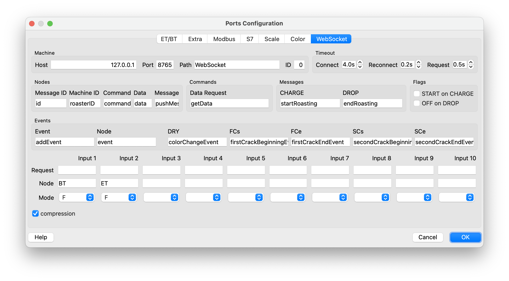
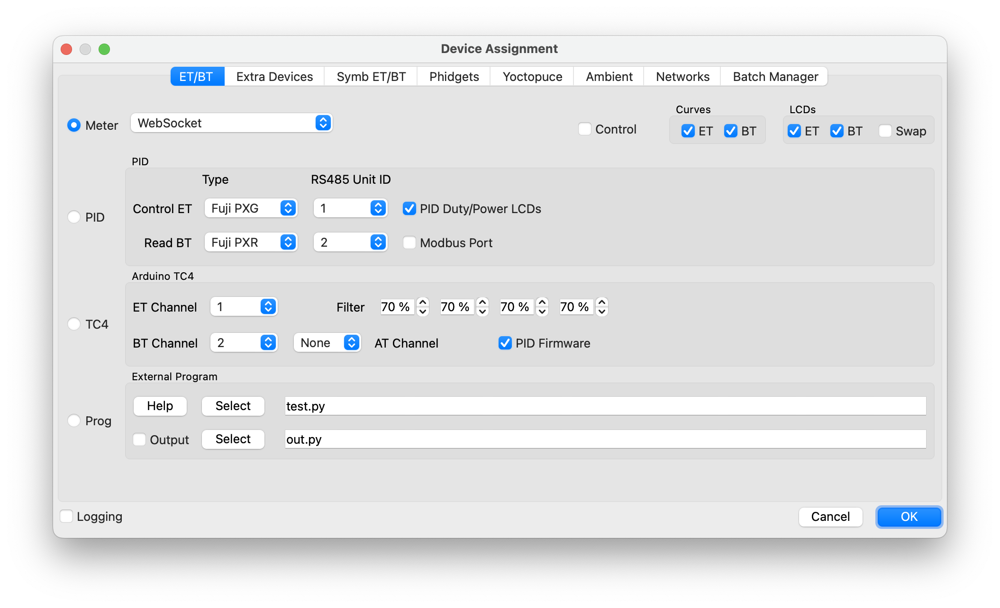

# Fugal Artisan Tools
Supplemental tools for working with [Artisan](https://artisan-scope.org/)

- `mqtt_artisan_bridge.py` - bridge MQTT to Artisan over WebSockets
- `artisan_log_markdown.py` print roast summary as markdown

Authors: Hans and Von Fugal
License: MIT

# MQTT to Artisan WebSocket Bridge

This tool bridges MQTT messages to Artisan roasting software via WebSocket, allowing Artisan to receive temperature data (ET and BT values) from an MQTT topic.

## Details

- Connects to MQTT broker with authentication
- Subscribes to specified topic for temperature data
- Parses JSON payloads to extract ET (Environmental Temperature) and BT (Bean Temperature) values
- Provides WebSocket server for Artisan to connect to
- Responds to Artisan's WebSocket requests with latest temperature values

## Prerequisites

- Python 3.7 or higher
- MQTT broker
- Artisan roasting software

## Installation

1. Install the required Python packages:
   ```bash
   pip install -r requirements.txt
   ```

## Configuration

The script is pre-configured with the following settings:
- MQTT Host: `bombadil`
- MQTT Port: `1883`
- MQTT Topic: `artisan`
- MQTT User: `artisan`
- MQTT Password: `cafe`
- WebSocket Host: `localhost`
- WebSocket Port: `8765`

To modify these settings, use the command-line options or modify the configuration section at the top of `mqtt_artisan_bridge.py`.

## Usage

Run the bridge:
   ```bash
   ./mqtt_artisan_bridge.py
   ```
   
   For debugging output:
   ```bash
   ./mqtt_artisan_bridge.py --debug
   ```

### Configure Artisan to connect to the WebSocket



- Config » Port… » WebSocket tab
  - Set the following parameters:
    - Host: `localhost`
    - Port: `8765`
    - Data Request: `getData`
  - For the input channels:
    - Input 1 (BT): Set Node to `BT`
    - Input 2 (ET): Set Node to `ET`



Config » Device…
  - Choose Meter
  - Choose "WebSocket" from the dropdown

The bridge will:
 - Connect to the MQTT broker
 - Subscribe to the `artisan` topic
 - Listen for JSON messages
 - Serve a WebSocket endpoint at `ws://localhost:8765/`
 - Respond to Artisan's requests with the latest data

## Expected MQTT Message Format

The bridge expects JSON messages with ET and BT values:

```json
{
  "ET": 220.5,
  "BT": 189.2
}
```

Other fields in the JSON will be ignored.

## Artisan Configuration

In Artisan's WebSocket configuration:
- The expected response format is:
  ```json
  {
    "id": 12345,
    "data": {
      "ET": 220.5,
      "BT": 189.2
    }
  }
  ```

## Logging

The application logs information to the console:
- Connection status to MQTT broker
- Received MQTT messages
- WebSocket client connections
- Sent responses to Artisan

## Troubleshooting

1. If the bridge cannot connect to the MQTT broker:
   - Verify the broker is running at the configured host and port
   - Check the username and password are correct
   - Ensure network connectivity to the broker

2. If Artisan cannot connect to the WebSocket:
   - Verify the bridge is running
   - Confirm the WebSocket settings in Artisan match the bridge configuration

3. If temperature values are not updating:
   - Verify MQTT messages are being published to the `artisan` topic
   - Check that the JSON format includes ET and BT fields
   - Ensure the bridge is receiving and parsing the messages (check logs)

# Artisan Log Markdown Extractor

Extracts roast information from Artisan log files (.alog) and converts it to markdown format for easy review.

## Usage
```
./artisan_log_markdown.py path/to/roast.alog > roast.md
./artisan_log_markdown.py path/to/roast.alog -o roast.md
find path/to/roasts -name '*.alog' | xargs -n1 ./artisan_log_markdown.py >> roasts.md
```